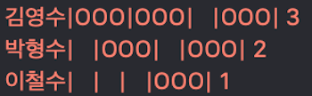
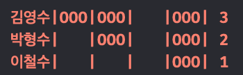
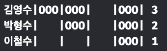
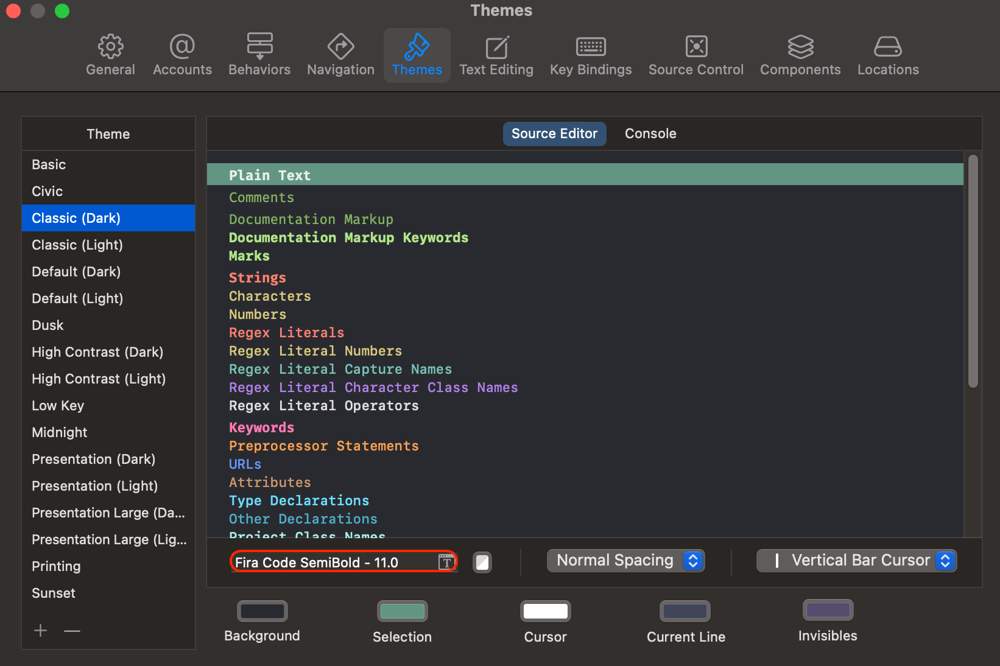

## 개발 환경을 위한 고정폭 글꼴

### 고정폭 글꼴이란

고정폭 글꼴은 모든 문자의 가로폭이 동일한 글꼴을 의미합니다. 이는 코드의 가독성 향상 및 정렬을 용이하게 하여 개발 효율성을 향상시키는 역할을 합니다.

### 고정폭 글꼴의 중요성

* 코드 정렬 및 가독성 향상: 모든 문자의 폭이 일정하기 때문에 코드의 세로 줄을 맞추기 쉽습니다. 이는 가독성 향상으로 이어집니다.
* 문자 구분 용이: `O`(대문자 O)와 `0`(숫자 0), `l`(소문자 L)과 `I`(대문자 i) 등 비슷하게 생긴 문자들을 명확하게 구분할 수 있습니다.


#### Code
  
`before`

`after`


  
#### Command line
  
`before`

`after`

    

### 설정 방법

Xcode의 테마 변경을 통해 글꼴 및 스타일을 변경할 수 있습니다.

``` swift
Xcode -> Settings -> Themes -> Font
```



