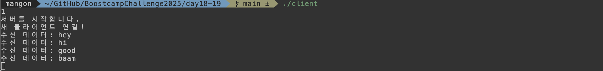
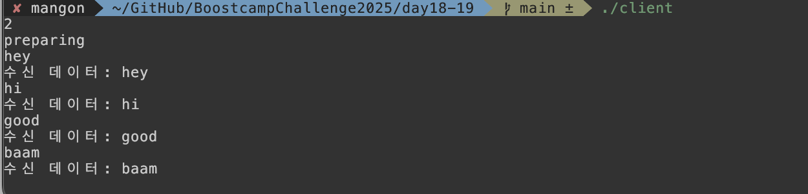

Swift에서 저수준 소켓을 직접 다루지 않고도, **연결 생성/수신/송수신**을 깔끔하게 구성할 수 있는 프레임워크가 `Network.framework`입니다.  
이 글에서는 핵심 타입을 빠르게 정리한 뒤, **에코 서버(Echo Server)** 를 간단히 구현/테스트하는 흐름으로 정리합니다.

## 문제 상황

간단한 TCP 서버/클라이언트를 만들 때 기존 BSD Socket 기반 구현은 설정/에러 처리/상태 관리가 번거로운 편입니다.  
`Network.framework`를 사용하면 다음을 비교적 직관적으로 구성할 수 있습니다.

- 서버: 리슨(포트 바인딩) → 인바운드 연결 수락 → 수신/응답 루프
- 클라이언트: 연결 → 상태 관찰 → 송신 → 수신

## Network.framework 개념 정리

네트워크 연결을 생성한 후, HTTP 또는 TLS와 같은 전송 및 보안 프로토콜을 사용해 데이터를 주고받습니다.  
이번 글에서는 연결 및 송수신의 뼈대를 이해하는 데 필요한 대표 타입 3개를 중심으로 봅니다.

### NWEndpoint

로컬 또는 외부 엔드포인트를 표현합니다. 연결의 “목적지(또는 리슨할 지점)”를 지정할 때 사용합니다.

- `hostPort(host:port:)`: 호스트/포트 조합 엔드포인트

```swift
let endPoint = NWEndpoint.hostPort(
  host: NWEndpoint.Host("127.0.0.1"),
  port: NWEndpoint.Port(integerLiteral: 9999)
)
```

### NWListener

네트워크 연결 요청을 수신할 때 사용하는 리스닝 객체입니다. 서버 측의 시작점입니다.

- `start(queue:)`: 리스너를 시작하고 이벤트를 처리할 큐를 지정합니다.
- `newConnectionHandler`: 들어오는 연결을 수락한 뒤 세션 처리를 시작하는 핸들러입니다.

```swift
func start() {
  listener.newConnectionHandler = { connection in
    self.handleConnection(connection: connection)
  }
  listener.start(queue: listenerQueue)
}
```

### NWConnection

로컬과 원격 엔드포인트 간의 데이터 연결(세션)입니다. 서버/클라이언트 양쪽에서 모두 사용합니다.

- `start(queue:)`: 연결을 시작하고 이벤트를 처리할 큐를 지정합니다.
- `stateUpdateHandler`: 연결 상태가 바뀔 때마다 호출됩니다.

```swift
func connect() {
  connection.stateUpdateHandler = { state in
    switch state {
    case .setup: break            // 초기 상태
    case .waiting(let error):     // 네트워크 대기/재시도 상황
      print(error)
    case .preparing: break        // 연결 준비
    case .ready: break            // 연결 성공 (송수신 가능)
    case .failed(let error):      // 연결 실패
      print(error)
    case .cancelled: break        // 연결 취소
    @unknown default: break
    }
  }
  connection.start(queue: .global())
}
```

- `send(content:contentContext:isComplete:completion:)`: 활성 연결을 통해 데이터를 전송합니다.
  - `content`: 보낼 `Data?` (nil이면 “콘텐츠 없는 프레임” 성격)
  - `contentContext`: 메시지 메타데이터(프로토콜/우선순위 등). 일반적인 TCP 스트림에서는 `.defaultMessage`
  - `isComplete`: 이 send가 “메시지 경계”로 완결되는지 표시(스트림에서도 프레이밍 힌트로 사용)
  - `completion`: 전송 결과 콜백(에러 포함)

## 에코 서버 (Echo Server)

에코 서버는 클라이언트로부터 받은 데이터를 **그대로 다시 돌려주는** 서버입니다. 구현이 단순해서 네트워크 학습/테스트에 자주 사용됩니다.

### 주요 사용 목적

- **네트워크 테스트**: 소켓 통신이 잘 되는지, 지연 시간, 패킷 손실 등을 확인
- **클라이언트 개발 검증**: 메시지 송수신 기능이 정확히 동작하는지 테스트
- **프로토콜 디버깅**: TCP/UDP, TLS 등 계층 별 동작 확인
- **성능 측정**: RTT(왕복 시간) 측정, 응답 속도 테스트

### 구현 포인트

이번 실습의 핵심 흐름은 아래와 같습니다.

#### **서버**

- `NWListener`로 포트 리슨
- `newConnectionHandler`에서 `NWConnection` 수락
- 연결이 `.ready`가 되면 `receive` 루프로 데이터 수신
- 수신한 데이터를 그대로 `send`로 다시 전송

``` swift
import Foundation
import Network

class EchoServer {
    let tcpListener: NWListener
    let listenerQueue = DispatchQueue(label: "ListenerQueue")

    init(
        port: NWEndpoint.Port
    ) throws {
        do {
            self.tcpListener = try NWListener(using: .tcp, on: port)
        } catch {
            throw error
        }
    }

    func start() {
        print("서버를 시작합니다.")
        tcpListener.newConnectionHandler = { connection in
            print("새 클라이언트 연결!")
            self.handleConnection(connection: connection)
        }

        tcpListener.start(queue: .main)
    }

    func handleConnection(connection: NWConnection) {
        connection.start(queue: listenerQueue)
        recieve(on: connection)
    }

    func recieve(on connection: NWConnection) {
        connection.receive(minimumIncompleteLength: 1, maximumLength: 4096) { content, contentContext, isComplete, error in
            guard let content = content else { return }
            print("수신 데이터: \(String(data: content, encoding: .utf8)!)")

            connection.send(
                content: content,
                completion: .contentProcessed( { error in
                    if let error = error {
                        print("재전송 에러: \(error)")
                    }
                    self.recieve(on: connection)
                })
            )
        }
    }
}
```

####  **클라이언트**

- `NWConnection(host:port:using:)`으로 서버에 연결
- 연결 `.ready` 이후 원하는 데이터를 `send`
- `receive`로 서버 응답을 확인

``` swift
import Foundation
import Network

class Client {
    let connection: NWConnection
    
    init(endPoint: NWEndpoint) {
        self.connection = NWConnection(to: endPoint, using: .tcp)
    }
    
    func connect() {
        connection.stateUpdateHandler = { state in
            switch state {
            case .setup:
                print("setup")
            case .waiting(let error):
                print("waiting \(error)")
            case .preparing:
                print("preparing")
            case .ready:
                self.startRecieve()
            case .failed(let error):
                print("failed \(error)")
            case .cancelled:
                print("cancelled")
            @unknown default:
                print("none")
            }
        }
        
        connection.start(queue: DispatchQueue.global())
        
        while let input = readLine() {
            send(input)
        }
    }
    
    func startRecieve() {
        connection.receive(minimumIncompleteLength: 1, maximumLength: 4096) { content, contentContext, isComplete, error in
            if let content = content {
                print("수신 데이터: \(String(data: content, encoding: .utf8)!)")
            }
            self.startRecieve()
        }
        
    }
    
    func send(_ request: String) {
        let data = request.data(using: .utf8)
        connection.send(content: data, completion: .contentProcessed { error in
            if let error = error {
                print("send error: \(error)")
            }
        })
    }
}
```

### 실행/테스트

- 서버 먼저 실행(포트 9999)
- 클라이언트 실행 후 문자열 입력
- 기대 결과: 서버/클라이언트 모두에서 동일한 문자열이 출력(에코)
#### 서버


#### 클라이언트



## 마치며

`Network.framework`를 사용하면 “연결 상태 관리 + 이벤트 기반 송수신”을 비교적 고수준 API로 구성할 수 있어, 간단한 실습부터 실제 제품 코드까지 확장하기가 좋았습니다.  
특히 `stateUpdateHandler`를 중심으로 연결 수명주기를 안정적으로 다루는 감을 잡은 뒤에는 재연결 정책 같은 요구사항도 단계적으로 얹기 쉬운 편이라고 느꼈습니다.

## 참고 자료

- [Apple Documentation - Network](https://developer.apple.com/documentation/network)
- [WWDC 2018 - Introducing Network.framework: A modern alternative to Sockets](https://developer.apple.com/videos/play/wwdc2018/715/)
- [[간단정리] HTTP Request/Response 구조](https://hahahoho5915.tistory.com/62)
- [What is HTTP/3? How it is Different From HTTP/2?](https://www.geeksforgeeks.org/computer-networks/what-is-http-3-how-it-is-different-from-http-2/)