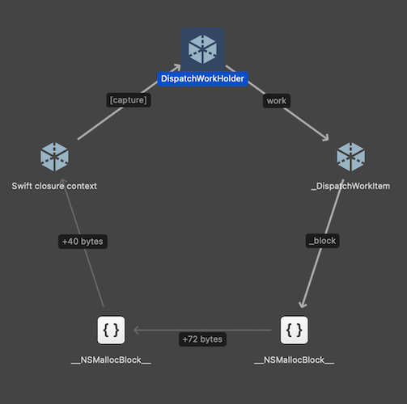
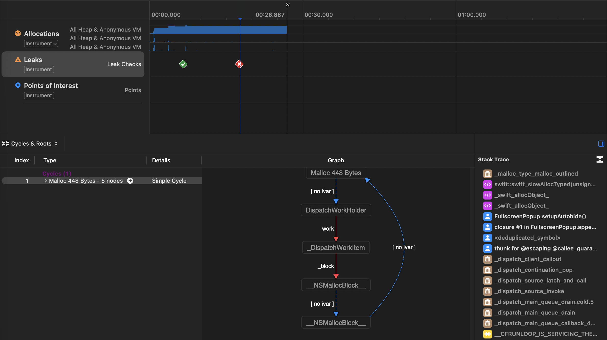
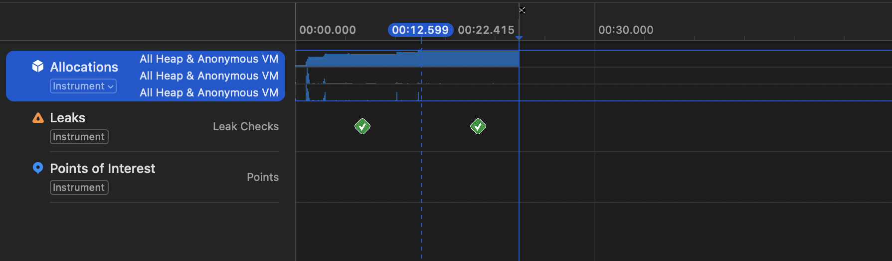

 > 이 글은 이전 블로그에서 이전한 글입니다. 이전하는 과정에서 내용을 수정 및 보완하였습니다.

프로젝트 진행 중 알림을 위한 Popup 뷰 라이브러리를 도입하게 되었습니다. 개발 진행 중 메모리 사용량에 이상을 느끼고 메모리 그래프를 분석하던 중 메모리 누수가 발생하는 것을 발견하였습니다. 분석 결과 도입하게 된 오픈소스 라이브러리에서 retain cycle 문제가 발생한 것을 알게 되었습니다. 해당 라이브러리 도입 후 많은 부분에 적용되고 있어 대체하기 어렵다고 생각하여 이슈를 직접 해결해보고자 하였습니다.

## 문제 상황

`Debug Navigator`로 CPU/메모리를 확인하던 중, 특정 화면에서 팝업을 여러 번 띄우면 **메모리가 감소하지 않고 누적**되는 현상을 확인했습니다.  도입한 오픈소스 Popup 라이브러리를 의심했고, 테스트 프로젝트를 만들어 원인을 좁혔습니다.

## 재현

Popup은 표시 여부를 외부 상태에 `Binding`합니다. 이때 바인딩 대상이 **View의 @State**인지, **외부 객체(ViewModel)의 상태**인지에 따라 결과가 달랐습니다.
### 상황 1: View의 `@State` 바인딩 (누수 X)

``` swift
struct ContentView: View {
	@State var isShowingPopup = false
    var body: some View {
        }
        .popup(isPresented: $isShowingPopup) {
	        ...
        } customize: {
            $0.autohideIn(2)
        }
    }
}
```

`@State`를 바인딩한 경우, 팝업 표시/해제 후 객체가 정상 해제되는 흐름을 확인했습니다.
### 상황 2: ViewModel 상태 바인딩 (누수 O)

프로젝트는 MVVM 패턴을 사용하고 있어 이 케이스가 실제 시나리오였습니다.

``` swift
final class ViewModel: ObservableObject {
    @Published var isShowingPopup = false
}
```

``` swift
struct ContentView: View {
	@StateObject var viewModel = ViewModel()
    var body: some View {
        }
        .popup(isPresented: $viewModel.isShowingPopup) {
	        ...
        } customize: {
            $0.autohideIn(2)
        }
    }
}
```

외부 객체(`ObservableObject`)의 상태를 바인딩한 경우, 재현 시나리오를 반복할수록 메모리가 누적되는 것을 확인했습니다.

## 분석 도구를 통한 메모리 분석

### Memory Graph



`Memory Graph`는 특정 시점에 할당된 객체들과 참조 관계를 그래프로 보여주는 디버깅 도구입니다.  
팝업이 사라진 이후 시점의 그래프에서 관련 객체들이 해제되지 않고 남아 있으며, **retain cycle**이 형성되어 있음을 확인했습니다.
### Instruments Leaks


Instruments의 **Leaks** 템플릿은 실행 중 누수로 의심되는 메모리를 추적합니다.  누수 재현 시나리오를 반복했을 때 특정 객체가 해제되지 않는 흐름을 확인했습니다.

## 코드 분석

문제의 핵심은 `autohideIn`이 설정된 경우, `DispatchWorkItem`을 만들어 일정 시간 뒤 실행하도록 스케줄링하는 부분이었습니다.

📂 [`Utils.swift`](https://github.com/exyte/PopupView/blob/master/Sources/PopupView/Utils.swift)
``` swift
final class DispatchWorkHolder {
    var work: DispatchWorkItem?
}
```

📂 [`FullscreenPopup.swift`](https://github.com/exyte/PopupView/blob/master/Sources/PopupView/FullscreenPopup.swift)
``` swift
public struct FullscreenPopup<Item: Equatable, PopupContent: View>: ViewModifier {
	...
    var autohideIn: Double?
	private var dispatchWorkHolder = DispatchWorkHolder()
    @State private var dismissSource: DismissSource?
    ....
    
	func setupAutohide() {
		if let autohideIn = autohideIn {
			// 클로저에서 self를 암묵적으로 캡처하고 있다.
			dispatchWorkHolder.work = DispatchWorkItem(block: { [weak isPresentedRef, weak itemRef] in
				...
				dismissSource = .autohide
				...
			})
	
			if sheetPresented, let work = dispatchWorkHolder.work {
				DispatchQueue.main.asyncAfter(deadline: .now() + autohideIn, execute: work)
			}
		}
	}
}
```

`DispatchWorkHolder`가 `DispatchWorkItem`을 강하게 보유하고 있고 `DispatchWorkItem` 클로저 내부에서 `dismissSource`를 변경하는 과정에서 `self`를 암묵적으로 캡처합니다. 이 연결로 인해 결과적으로 **순환 참조**가 발생합니다.

## 해결 과정

순환 참조를 끊기 위해 세 가지 접근 방법을 시도하였습니다.
### 1️⃣ class → struct로 변경

`DispatchWorkHolder`를 값 타입으로 바꾸면 참조 카운트 증가를 피할 수 있다고 생각해 시도했습니다.

```swift
struct DispatchWorkHolder {
    var work: DispatchWorkItem?
    mutating func change(item work: DispathWorkItem) {
	    self.work = work
    }
}

public struct FullscreenPopup<Item: Equatable, PopupContent: View>: ViewModifier {
    @State var dispatchWorkHolder = DispatchWorkHolder()
    ...
    func setupAutohide() {
        if let autohideIn = autohideIn {
            ...
			let newWorkItem = DispatchWorkItem(block: { [weak isPresentedRef, weak itemRef] in
                isPresentedRef?.value.wrappedValue = false
                itemRef?.value.wrappedValue = nil
                dismissSource = .autohide
            })
            dispatchWorkHolder.change(item: newWorkItem)
            ...
        }
    }
}
```

이 방법으로 누수 자체는 해결할 수 있었지만 다음과 같은 이유로 채택하지 않았습니다.

- 값 타입의 복사로 인해 참조가 끊길 가능성이 존재합니다. 
- SwiftUI의 View는 자주 재생성됩니다. 따라서 이전 work를 안정적으로 취소 및 교체의 목적이 흔들릴 수 있습니다.

### 2️⃣ 약한 참조

약한 참조를 하면 Reference count를 증가시키지 않습니다. `setupAutohide()` 내부의 클로저에서 `DispatchWorkHolder`를 재참조하기 때문에 cycle이 생긴다고 생각하였습니다. 이는 클로저 구문에서 `weak self`를 통해 해결할 수 있을 것이라 생각하였습니다. 

```swift
dispatchWorkHolder.work = DispatchWorkItem(block: { [weak self, weak isPresentedRef, weak itemRef] in
	...
})
```

하지만 다음과 같은 에러가 발생하였습니다.

``` 
'weak' may only be applied to class and class-bound protocol types, not 'FullscreenPopup<Item, PopupContent>
```

이는 현재 `FullscreenPopup`은 구조체이기 때문에 발생한 에러입니다. 구조체는 ARC의 대상이 아니고 약한 참조의 개념은 class에만 존재하기 때문에 이는 해결 방법이 될 수 없었습니다.

### 3️⃣ 직접 할당 해제

참조 횟수(Reference Count)를 줄이기 위해, **작업이 완료되는 시점에 `DispatchWorkItem`을 직접 `nil`로 설정**하여 사이클을 끊어주었습니다.

```swift
dispatchWorkHolder.work = DispatchWorkItem(block: { [weak isPresentedRef, weak itemRef] in
	...
	dismissSource = .autohide
	dispatchWorkHolder.work = nil // 추가
})
```

이를 통해 사이클을 제거하고 메모리 누수를 해결할 수 있었습니다. 이 수정 후, 아래와 같이 Instruments에서 더 이상 메모리 누수가 발견되지 않음을 확인했습니다.


## 마치며

확보한 메모리 자체는 사소할 수 있지만, 작은 누수가 쌓이면 큰 문제로 이어질 수 있다고 생각했습니다. 라이브러리의 코드베이스가 크지 않아 해결할 수 있었지만, 코드 한 줄의 해결책을 찾기까지 코드 분석, 메모리 관리, 참조 관계 공부에 오랜 시간 할애하였습니다.

포기하고 싶었지만 끝까지 해내겠다는 집념으로 완료한 작업이었고, 결과적으로 엄청난 학습 경험이 되었습니다. 더 나은 방법이 있을 수 있지만, 문제를 해결하고 개발자로서 한 단계 성장하는 소중한 경험이었습니다.


## 참고 자료

- [PopupView GitHub Repository](https://github.com/exyte/PopupView)
- https://ios-development.tistory.com/1233
- https://docs.swift.org/swift-book/documentation/the-swift-programming-language/automaticreferencecounting/